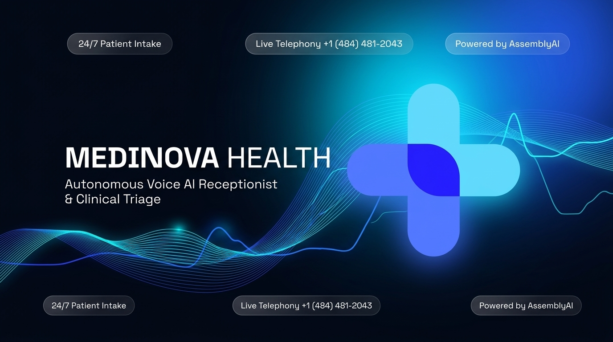

# Medinova Health - Clinical Voice AI & Triage Platform

> **Never put a patient on hold again.**  
> Medinova Health is an enterprise clinical voice AI platform that automates patient phone intake, recognizes returning callers with full medical context, performs real-time clinical triage, and schedules appointments directly into the clinic calendar.

<p align="center">
  <a href="https://medinova-assemblyai.vercel.app">
    
  </a>
</p>

[](https://medinova-assemblyai.vercel.app/)
[](https://www.assemblyai.com/)
[](https://livekit.io/)
[](tel:+14844812043)
[](https://nextjs.org/)
[](https://www.mongodb.com/)

---

## 📞 Try It Live

- **Direct Inbound Telephony**: Call [`+1 (484) 481-2043`](tel:+14844812043) from any phone to experience conversational patient intake, returning caller memory, and appointment scheduling in real time.
- **Clinical Web Portal**: [medinova-assemblyai.vercel.app](https://medinova-assemblyai.vercel.app/)
- **How to Test**:
  1. **Multilingual Intake**: Speak in any language (e.g., Spanish, German, French, Urdu). Notice AssemblyAI's real-time comprehension and the agent's clear English triage response.
  2. **Caller Memory**: Introduce yourself by name (e.g., *"Hi, I'm Jacob, calling about a sprained ankle"*), then hang up. Call back from the same number - Medinova will greet you by name and reference your prior complaint!
  3. **Emergency Escalation**: Mention acute symptoms like chest pain or difficulty breathing to trigger immediate 911 escalation.

---

## 🏥 System Architecture

```
┌─────────────────────────────────────────────────────────────┐
│                       Caller / Patient                      │
│            (Telephone SIP Trunk or WebRTC Browser)          │
└──────────────────────────────┬──────────────────────────────┘
                               │ Bi-directional Audio
                               ▼
┌─────────────────────────────────────────────────────────────┐
│                        LiveKit Cloud                        │
│                 (WebRTC SFU / Media Server)                 │
└──────────────────────────────┬──────────────────────────────┘
                               │
             ┌─────────────────┴──────────────────┐
             │ Room Events                        │ WebRTC Tokens
             ▼                                    ▼
┌──────────────────────────────┐       ┌───────────────────────┐
│    medinova-livekit-agent    │       │       next-app        │
│    (Python LiveKit Worker)   │       │  (Next.js Dashboard)  │
│                              │       │                       │
│  • AssemblyAI Universal 3.5  │       │ • Triage Queue        │
│  • Returning Caller Memory   │       │ • Booking Calendar    │
│  • OpenAI gpt-4o-mini LLM    │       │ • In-Browser Voice Lab│
│  • Inworld TTS 2.0 Flash     │       │ • Admin Orchestration │
│  • Silero VAD + BVC Audio    │       │ • Prisma ORM          │
│  • GPT-4.1-mini Triage       │       │                       │
└──────────────┬───────────────┘       └──────────┬────────────┘
               │                                  │
               │ Direct Writes & Webhooks         │ Queries
               ▼                                  ▼
┌─────────────────────────────────────────────────────────────┐
│                    MongoDB Atlas Database                   │
│      (Call Records, Appointments, Staff, Bot Settings)      │
└─────────────────────────────────────────────────────────────┘
```

---

## 💡 Why AssemblyAI Universal 3.5 Pro?

In clinical phone intake, standard batch or generic STT models fail: they cut patients off mid-sentence, choke on medical terminology, and hallucinate on regional accents or multilingual callers.

Medinova leverages **AssemblyAI Universal 3.5 Pro** natively within LiveKit's streaming pipeline:

- **Punctuation-Based Turn Detection**: Employs real-time punctuation turn detection (`turn_detection="stt"`, `min_turn_silence_ms=100`, `max_turn_silence_ms=1000`). Callers can pause naturally while articulating painful symptoms without the assistant cutting them off prematurely.
- **Multilingual Patient Comprehension**: Patients can speak in their native tongue - Spanish, French, German, Urdu, and more. AssemblyAI accurately transcribes multilingual audio streams on the fly, allowing the agent to comprehend the clinical intent and respond in compassionate, standardized English.
- **Medical & Phonetic Fidelity**: Transcribes medication names, anatomical references, and complex symptoms without acoustic degradation.
- **Sub-Second Streaming Latency**: Delivers ultra-low conversational turnaround over WebSockets for natural, human-cadence phone conversations.

---

## ⚡ Key Capabilities

### 1. Caller Memory & Historical Continuity
- Automatically extracts the caller's phone number on incoming SIP or WebRTC sessions.
- Queries MongoDB Atlas to identify returning patients and injects past call summaries, previously booked appointments, and chief complaints into live system prompts.
- Greets returning callers naturally by name without redundant questions.

### 2. Speech-to-Text via AssemblyAI Universal 3.5 Pro
- **Universal 3.5 Pro Streaming STT**: Uses AssemblyAI's state-of-the-art streaming model with real-time punctuation-based turn detection (`turn_detection="stt"`, `min_turn_silence_ms=100`, `max_turn_silence_ms=1000`).
- **Multilingual Caller Comprehension**: Showcases AssemblyAI's multilingual recognition - patients may speak in any language (e.g., Spanish, French, German, Urdu) with medical-grade transcription accuracy.
- **Standardized English Response**: While comprehending any incoming language, the voice agent synthesizes its responses in clear, empathetic British English (`inworld-tts-2-flash`) and logs the patient's spoken language for clinician review.
- **Sub-Second Latency**: Delivers ultra-low conversational turn latency suitable for critical clinical intake.

### 3. Automated Clinical Department Routing
- Dynamically routes callers to five specialized departments:
  - **Cardiology**: Chest concerns, hypertension, palpitations.
  - **General Medicine**: Fever, general ailments, routine follow-ups.
  - **Endocrinology**: Diabetes, thyroid disorders, hormone therapies.
  - **Obstetrics & Gynecology**: Prenatal intake, women's health.
  - **Pediatrics**: Child healthcare, immunizations.

### 4. Appointment Scheduling directly from Voice
- Proposes available doctor calendar slots during the conversation.
- Upon verbal confirmation, automatically creates the `Appointment` and `Patient` records in MongoDB.

### 5. Strict Clinical Boundaries & Emergency Escalation
- Refuses to give diagnoses or prescribe medication.
- Immediately identifies emergency keywords and directs the patient to call emergency services (**911**).

### 6. Post-Call AI Triage
- Automatically processes call transcripts via GPT-4.1-mini into 12 structured fields: spam detection, clinical urgency (`URGENT`, `HIGH`, `MEDIUM`, `LOW`), callback necessity, and recommended doctor actions.

---

## 📁 Repository Structure

| Path | Description |
|---|---|
| [**`next-app/`**](./next-app) | Next.js 16 App Router clinical dashboard, staff portal, and in-browser voice testing lab. |
| [**`medinova-livekit-agent/`**](./medinova-livekit-agent) | Python LiveKit Agents voice worker with AssemblyAI STT, Inworld TTS, and caller memory. |
| [**`.agents/`**](./.agents) | Project skills (`assemblyai`, `twilio`, `mongodb-*`, `livekit-agents`). |
| [**`PROJECT_SUMMARY.md`**](./PROJECT_SUMMARY.md) | Technical architecture overview and system specifications. |

---

## 🚀 Quickstart

### 1. Prerequisites
- Node.js `v20+` & npm
- Python `3.12+` & [uv](https://docs.astral.sh/uv/)
- LiveKit Cloud account
- AssemblyAI API Key
- OpenAI API Key
- MongoDB Atlas cluster

### 2. Next.js Dashboard Setup
```bash
cd next-app
npm install
npx prisma generate
npm run dev
```
Open [http://localhost:3000](http://localhost:3000) to view the clinical dashboard.

### 3. Voice Agent Worker Setup
```bash
cd medinova-livekit-agent
uv sync
uv run python agent.py dev
```
To connect the voice agent to your LiveKit Cloud room, use the LiveKit CLI or launch a test call directly from the Next.js **Voice Lab** (`/user/voice-lab`).

---

## 🔐 Environment Variables

### `next-app/.env`
```ini
DATABASE_URL="mongodb+srv://<user>:<password>@<cluster>.mongodb.net/medinova-assembly-ai"
LIVEKIT_URL="wss://<your-project>.livekit.cloud"
LIVEKIT_API_KEY="<your-api-key>"
LIVEKIT_API_SECRET="<your-api-secret>"
JWT_SECRET="<your-secret-key>"
NEXT_PUBLIC_APP_URL="http://localhost:3000"
```

### `medinova-livekit-agent/.env.local`
```ini
LIVEKIT_URL="wss://<your-project>.livekit.cloud"
LIVEKIT_API_KEY="<your-api-key>"
LIVEKIT_API_SECRET="<your-api-secret>"
ASSEMBLYAI_API_KEY="<your-assemblyai-key>"
OPENAI_API_KEY="<your-openai-key>"
MONGODB_URI="mongodb+srv://<user>:<password>@<cluster>.mongodb.net/medinova-assembly-ai"
ORGANIZATION_ID="<mongo-object-id>"
DASHBOARD_URL="http://localhost:3000"
```

---

## 📄 License
Copyright © 2026 Mubashir Ahmed Siddiqui / Medinova Health. All Rights Reserved.  
Proprietary and Confidential. Unauthorized copying, distribution, or commercial use is strictly prohibited. See [LICENSE](./LICENSE) for evaluation terms.
